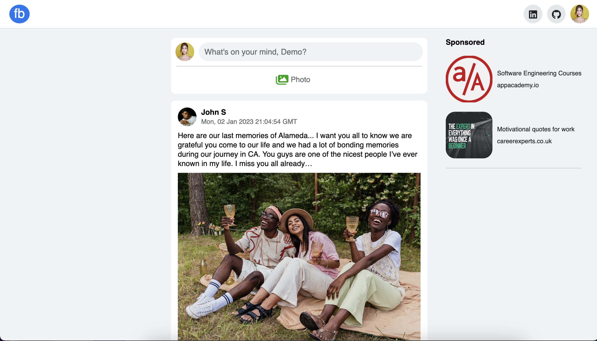
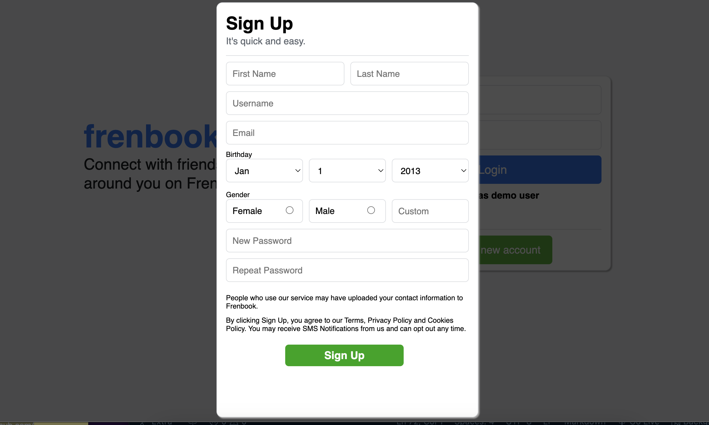
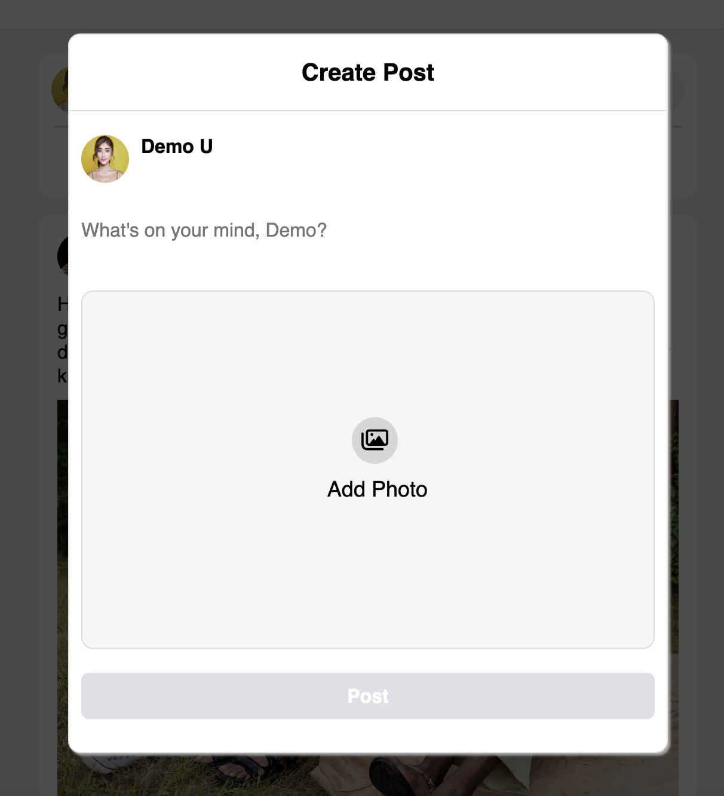

## About Frenbook:

Frenbook is a web application inspired by Facebook, that provides a platform for social networking where user can express their opinions, thoughts and views.

Click here to explore more: [Frenbook live site]

## Wiki Link
- [Backend Routes]
- [Database Schema]
- [Feature List]
- [Frontend Routes]

This project is built with:

Database:

Hosting:

## Feauture Directions:

### Load all posts:

### Sign up new account:
You will be able to create new account and log in at the same time
 

### Sign in/ Demo User:
You will be able to text feautures without sign up by click on the "Demo User" in the sign in form.
 

### Create new post:
You will be able to post new thoughts and/or photo:
 

### Update new post:
You will be able to update your post
 

### Delete post:
You will be able to delete your spot

### Leave/edit comment:
You will be able to leave comments for posts
 

### Delete comment:
You will be able to delete your comment

### Like a post:
You will be able to like any post once.

<!-- external links -->

[Frenbook live site]: https://frenbook.herokuapp.com/
[Backend Routes]: https://github.com/jadevie/FrenBook/wiki/Endpoints
[Database Schema]: https://github.com/jadevie/FrenBook/wiki/Database-Diagram
[Feature List]: https://github.com/jadevie/FrenBook/wiki/MVP-Feature-list
